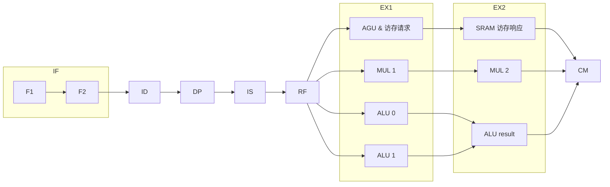

# 设计文档

---

## 1. 总体设计概览

本系统为实现 LoongArch 架构下 25 条特定指令的 32 位顺序双发射处理器及 SoC. 

处理器采用九级流水线结构，配合透明 Cache 层次与片外 SRAM 控制器。

整个 SoC 使用统一的 cpu_clk = 120 MHz.

CPU 接口通过类 SRAM 协议直接对接 BaseRAM、ExtRAM 与串口内存映射空间。

### 指令集

```
ADD.w SUB.w ADDI.w SLT LU12I.w PCADDU12I
AND OR XOR ANDI ORI SLL.w SLLI.w SRLI.w
MUL.w
LD.w LD.b ST.w ST.b
B BL JIRL BEQ BNE
CPUCFG
```

---

## 2. 处理器微架构设计

处理器核采用九级顺序双发射流水线：



### 2.1 IF & BPU

IF 流水级在内部拆分为 F1 与 F2 两级：

- **F1**：按 64 位对齐边界向 I-Cache 发起取指请求，同时根据 BPU 输出计算下一拍 PC。若 BPU 对 slot0 预测跳转，则下一条请求目标地址；否则在 8 字节块内顺序取指，或根据 slot1 的预测跳转更新 PC。
- **F2**：接收 I-Cache 返回的 64 位数据，解析并向 ID 交付 1~2 条 32 位指令。若起始 PC 为 8 字节块内的第二个字、或 slot0 预测跳转，则只交付 slot0；未交付的指令在本拍缓存，下一拍继续送出。

**BPU**：采用 BTB。预测成功时在 F1 直接重定向 PC；预测失败时在 EX1 解析实际分支跳转，清空年轻级流水线并校正 PC.

### 2.2 ID

instruction decode

### 2.3 DP

6 项 FIFO，每拍允许入队 1 到 2 条指令。

### 2.4 IS

设计上，将指令分为五类：

 - N：普通指令
 - MU：乘法指令
 - B：分支指令
 - ME：访存指令
 - S：特殊指令，永远单发射，只有 cpucfg

判断是否可并发：

| slot0/slot1 | N | MU | B | ME | S |
|-------------|---|----|---|----|---|
| N           | y | y  | y | y  | n |
| MU          | y | n  | y | y  | n |
| B           | y | y  | n | n  | n |
| ME          | y | y  | y | n  | n |
| S           | n | n  | n | n  | n |

这里是简化的表格，详见 [coissue.md](https://github.com/Arctitico/nscscc2026/blob/inorder-dual-issue/doc/coissue.md) .

### 2.5 RF

寄存器堆提供 4 个读端口与 2 个写端口。

在读寄存器堆的同时，处理来自 EX1、EX2、CM 的前递，详见 [forward.md](https://github.com/Arctitico/nscscc2026/blob/inorder-dual-issue/doc/forward.md) .

### 2.6 EX

将 EX 流水级拆为 EX1 和 EX2.

#### (0) MUL

两周期流水乘法器。

对于一连串的 mul.w 指令，在没有数据冒险的情况下可以每拍发射一条 mul.w 指令，II=1. 这是把 EX 拆为 EX1 和 EX2 的一个重要原因。

#### (1) EX1

两个 ALU ：无需多言

一个 AGU ：计算访存地址。声明 `(* keep = "true" *)`，防止 vivado 优化掉。在本流水级发起访存请求，理想情况下可以在下一周期、位于 EX2 时得到访存响应。

一个 MUL ：乘法器的第一个阶段，锁存操作数 A/B.

#### (2) EX2

AGU 在 EX1 发起的访存请求将在 EX2 等待、直到得到响应；乘法器在 EX2 输出最终乘积。

### 2.7 CM

EX2 完成后直接进入物理隔离的 CM 级进行程序序提交。

---

## 3. 存储系统与 Cache 架构

系统的存储层次针对片外 SRAM 的物理特性进行设计，在透明 Cache 下提高有效访存带宽。

```
  +-------------------------------------------------------------+
  |                        thinpad_top                          |
  |  +--------------------+             +--------------------+  |
  |  |      I-Cache       |             |  D-Cache (4 KiB)   |  |
  |  | (2路, 16B Line)    |             | (Write-Through)    |  |
  |  +---------+----------+             +---------+----------+  |
  |            |                                  |             |
  |            |     +----------------------+     |             |
  |            |     | 4-entry Write Buffer |<----+             |
  |            |     +----------+-----------+                   |
  |            |                |                               |
  |            v                v                               |
  |  +-------------------------------------------------------+  |
  |  |                      mem_bridge                       |  |
  +--+--------------------------+----------------------------+--+
                                |
             +------------------+------------------+
             |                                     |
             v                                     v
  +----------------------+               +----------------------+
  |  BaseRAM sram_ctrl   |               |  ExtRAM sram_ctrl    |
  |  (0x1c000000-3fffff) |               |  (0x1c400000-7fffff) |
  +----------------------+               +----------------------+
```

### 3.1 Cache 结构规格

- **I-Cache**：2 路组相联，行大小 16 字节，支持对齐双指令并行读取。
- **D-Cache**：4 KiB 容量，2 路组相联，行大小 16 字节。采用 Write-Through 与 No-Write-Allocate 策略。所有有效写请求进入 4 项 Write Buffer 队列顺序排空。

### 3.2 Critical Word First 机制

D-Cache 发生 Demand Miss 时，向片外发起 4-beat 突发传输。传输从 CPU 实际请求的 Word 地址（Critical Word）开始，并在 16 字节 Line 内部自然回绕。首 Beat 数据返回时即刻触发 Early Restart 唤醒 CPU，剩余三 Beat 补全整行，降低访存缺失惩罚。

### 3.3 自适应单字/整行服务与预取

1. **8 项 Per-PC 迟滞表**：内部维护 8 项 Full-PC-Tag 观察表，实时跟踪 Load 指令的局部性。对于低局部性的随机访存，自适应降级为不分配 Cache 的单字（Single-Word）服务，保护 Cache 替换槽。
2. **周期性 Probe 机制**：单字模式下每服务 16 次自动发起一次整行 Probe 探测；检测到连续 Stride 访存时，重新恢复整行 Refill 模式。
3. **Per-PC Stride 预取器**：包含 8 项 Direct-Mapped 单步长预取训练表及 2 项 16 B Stream Buffer，提升连续数组遍历程序的访存吞吐量。

### 3.4 硬件自修改代码一致性

在硬件层面保证自修改代码的正确执行：
- 当已接受的 Store 写入指令内存区域（命中任何 I-Cache Resident 或 In-Flight 传输行）时，硬件自动触发 flush 信号，清空 I-Cache 与 BPU 中的预测状态。
- 流水线保留触发 Store 及其更早的指令，从 `store_pc + 4` 发起精确重取指，确保后续执行最新写入的指令。

---

## 4. 直连 SoC 与片外 SRAM 控制

片外系统整合了 CPU 核、访存仲裁桥、两套独立 SRAM 控制器及串口收发器。

### 4.1 存储映射与并发拓扑

顶层模块 `thinpad_top` 统一管理片上设备与存储映射：

- **BaseRAM**：映射区间 `0x1c000000–0x1c3fffff`，承载代码段与指令取指。
- **ExtRAM**：映射区间 `0x1c400000–0x1c7fffff`，承载数据段与堆栈访存。
- **串口（UART）**：映射区间 `0x1f000000–0x1f0fffff`，`+0` 偏移为收发 DATA 寄存器，`+5` 偏移为 STATUS 寄存器（bit 5 为 `TX_READY`，bit 0 为 `RX_READY`）。波特率设置为 115200 8N1，`TX_READY` 标志在停止位发送完成后置位。

两套片外 SRAM 控制器独立运行，支持并行进行 BaseRAM 取指与 ExtRAM 数据读写。

### 4.2 SRAM `2/2/1` 时序控制器

片外挂载两片 SRAM。控制器将物理纳秒需求按 CPU 工作频率向上取整转换为时钟周期：

- **读访问周期（Read Latency）**：2 拍
- **写脉冲宽度（Write Pulse）**：2 拍
- **写后保持时间（Write Hold）**：1 拍

系统采用离散 `2/2/1` 时序配置。写后保持周期内，地址、字节使能、写数据及三态驱动线保持稳定，避免上升沿竞争与总线数据碰撞。

### 4.3 复位与物理总线保护

在 PLL 未锁定或 CPU 处在复位状态时，`thinpad_top` 强行撤销两片 SRAM 的片选（`CE#`）、读使能（`OE#`）、写使能（`WE#`）及数据三态驱动（置高阻），防止总线数据争用。